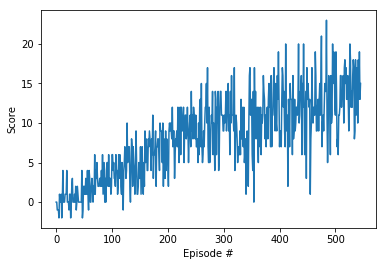

# Project 1 Report

## Learning Algorithm

The implementation is a vanilla Deep Q-Network with three fully connected layers: two hidden layers of 64 units each with ReLU activation and an output layer of 4 units. The hyperparameters used are:

| Hyperparameter | Value |
| ------------- | ------------- |
| first hidden layer units | 64 |
| second hidden layer units | 64 |
| replay buffer size | 1e5 |
| batch size | 64 |
| discount factor (gamma) | 0.99 |
| tau | 1e-3 |
| learning rate | 5e-4 |
| update the network every __ time steps | 4 |
| number of episodes | 2000 |
| max time steps per episode | 1000 |
| starting epsilon value | 1.0 |
| ending epsilon value | 0.01 |
| epsilon decay rate | 0.995 |

## Plot of Rewards

The plot below shows that, after 546 episodes, the agent is able to receive an average reward of 13.06 over the last 100 consecutive episodes.

## Ideas for Future Work

Since the introduction of Deep Q-Learning, new ideas for improving the agent's performance has emerged:

- [Double DQN](https://arxiv.org/abs/1509.06461)
- [Dueling DQN](https://arxiv.org/abs/1511.06581)
- [Prioritized Experience Replay](https://arxiv.org/abs/1511.05952)

DQN has a tendency to overestimate both the value and the action-value (Q) functions, this is known as Maximization Bias, this is because there is no way to evaluate if the action with the max value is actually the best action.

Double Deep Q Network propose to address Maximization Bias with the use of two Deep Q Networks.

- One DQN is responsible for the selection of the next action (the one with the maximum value) as always.
- Another DQN is the Target network is responsible for the evaluation of that action.

By decoupling the action selection from the target Q-value generation, we are able to substantially reduce the overestimation, and train faster and more reliably. For a more detailed explanation on how Double DQN works, refer to previous mentioned paper.

Implementing a Double DQN can be an interesting next step to improve the existing agent.

References:
- [Improvements in Deep Q Learning: Dueling Double DQN, Prioritized Experience Replay, and fixed Q-targets](https://medium.freecodecamp.org/improvements-in-deep-q-learning-dueling-double-dqn-prioritized-experience-replay-and-fixed-58b130cc5682)
- [Taking Deep Q Networks a step further](https://sergioskar.github.io/Taking_Deep_Q_Networks_a_step_further/)

